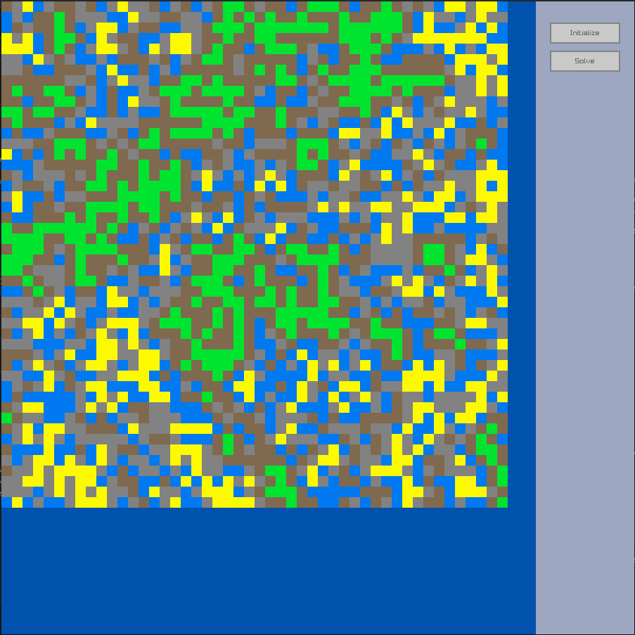
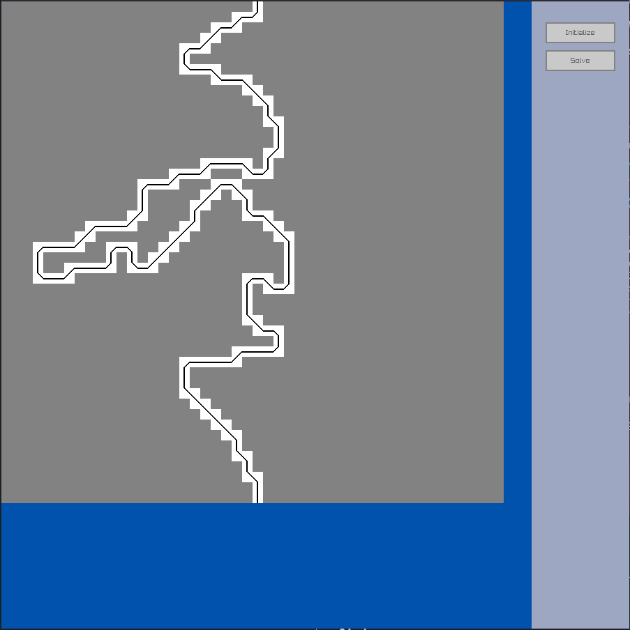

# LufuWFC
This is my own implementation of the WaveFunctionCollapse Alogrithm

* [Features](#features)
* [Notes](#notes)
* [Building](#building)
* [Media](#media)
* [License](#license)

## Features
* **Raylib Example:** Easy to use example tileset with raylib and raygui with button controls
* **JSON Tileset:** Create your own tilesets with json
* **Backtracking:** The WFC will try to automatically correct unsolvable states

## Notes
### Analogy: Quantum Mechanics

Imagine every single cell in your final output grid is in a state of superposition. This means it hasn't decided what it is yet. it is simultaneously all possible tiles at once.

1. Observation: You pick one cell that is still in superposition and "observe" it. This forces it to make a choice.

2. Collapse: The observation causes the cell's "wave function" to collapse. It randomly chooses one single state (one tile) from its list of possibilities, becoming fixed.

3. Propagation: The choice made by the collapsed cell has consequences for its neighbors. If you place a "beach" tile, its neighbor can no longer be a "mountain peak." This information "propagates" outwards, reducing the possibilities for neighboring cells. This process continues until the system is stable again.

Repeat this Observe, Collapse, Propagate cycle until every cell in the grid has collapsed into a single, determined state.

## Building

### Prerequisites
* **CMake** (3.15 or newer)
* **C++ Compiler** (e.g.,GCC, Clang, MSVC)
* **Git** (for fetching dependencies)

### Desktop Build (Windows, macOS, Linux)
1. **Configure and build with CMake:**
    ```bash
    mkdir build
    cd build
    cmake ..
    cmake --build .
    ```
    The example binaries will be located in the `build/bin` directory.

## Media
### Example solve with landtiles tileset:


### Example solve with pathtiles tileset:



## License
This project is licensed under the MIT License - see the [LICENSE](LICENSE) file for details.